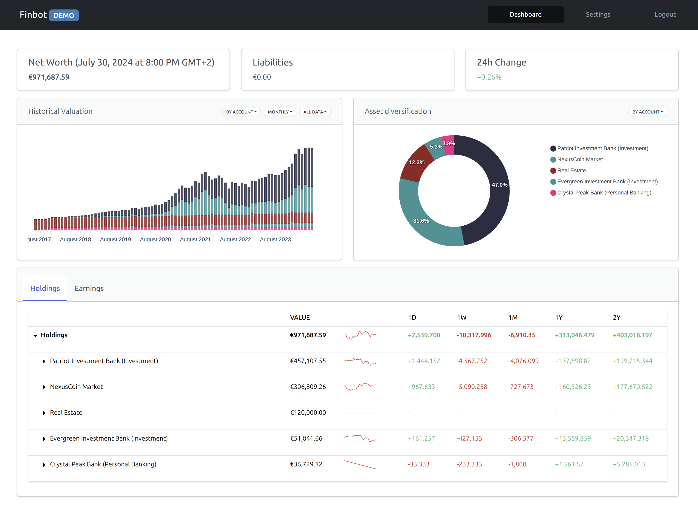

# finbot

Try finbot [here](https://demo.jboulanger.fr/finbot/) (email: `demo@finbot.com`, password: `demo`)

## 1. Introduction

Open-source personal wealth & financial data aggregation and reporting platform.
Currently supports the following data providers:

- Any provider available [via Plaid](https://plaid.com/uk/) (open banking)
- Credit agricole (via Playwright)
- Aegon Targetplan (via Playwright)
- Kraken, Binance, Bittrex (via respective APIs)
- Manually managed via Google sheet

### 1.1 Important disclaimer

This platform is **intended to be self-hosted** (_i.e. will not and should
not be made available as a public service_) as it stores and uses personal 
credentials to access external financial platforms and services.
This software is built as a proof of concept, **use at your own risk!**

## 2. Getting started

### 2.1. Getting up and running

**Note**: the following has been tested on Linux and MacOs environments. No
promise this works on Windows.

At the time being, the recommended way to run `finbot` is via docker. If you
are running finbot for the first time, you need to run:

```bash
(host) $ ./finbotctl init
```

This command builds required Docker images for each `finbot` endpoint, and
initializes the database with minimal required data.

The backend and fronted can then be started with:

```bash
(host) $ ./finbotctl start
```

Note that for the first run, it will take a while for the frontend to start
because Javascript dependencies are fetched for the first time. Once done, the 
frontend can be accessed on [http://127.0.0.1:5005](http://127.0.0.1:5005) (_by 
default_).

Similarly, you can stop all `finbot` endpoints with:

```bash
(host) $ ./finbotctl stop
```

### 3. `finbot` architecture

#### 3.1 Backend components (`finbot/` subdirectory)

`finbot` backend implementation (Python):

- `apps/`: Backend applications (_web servers, scheduler_)
- `clients/`: Python clients given access to backend servers.
- `core/`: General-purpose packages (_high-level utilities, etc._)
- `model/`: `finbot` `SQLAlchemy` business model (_used to create finbotdb 
  database schema_)
- `providers/`: Implement the `finbot.providers.Base`. Each module gives access to
   a specific financial data provider:
   - Most implement `providers.PlaywrightBased`, which use headless `Chrome` / 
   `playwright` to interact and scrape financial data off of external providers
   websites.
   - Others use proper APIs to access information (Google sheets API, Kraken for
   instance)

#### 3.2. Frontend components (`webapp/` subdirectory)

`finbot` web application implementation, based on node/React.

#### 3.3. Services topology

The finbot infrastructure is composed of 5 backend (web) services, one
database and a web application:

- **finbotwsrv / clients.finbot**: Web server responsible for fetching
financial data from external providers. It's a simpler wrapper around `finbot.providers`.
- **snapwsrv / clients.snap**: Web server responsible for the orchestration of
a single user account financial data snapshot (fetching and aggregating financial
data for all external accounts linked to a user account). This service interacts
directly with `finbotwsrv`.
- **histwsrv / clients.history**: Write financial reports for a given snapshot.
This includes:
  - **Fetching** 'consistent' financial data snapshot from the specified and 
    historical snapshots.
  - **Valuation of** user account, external accounts, sub-accounts (_accounts 
    under an external account_) and sub-accounts items (_assets, liabilities_).
  - **Valuation change (hourly, daily, monthly, etc.) of** user account, 
    external accounts, sub-accounts and sub-accounts items.
  - **[To be implemented]** Add (_resp. update_) new (_resp. existing_) 
    transactions in all external accounts.
- **schedsrv**: Currently in **very early** development stage. Will be 
  responsible for triggering and distributing the work required to snapshot and
  report financial data for individual user accounts. Currently only works for
  a single user account (hard-coded) and on a fixed schedule (once per hour by default)
- **appwsrv**: Public rest API exposing applicative features. Used directly by 
  the finbot web application. This includes, but is not limited to:
  - Users management (authentication, user creation, etc.)
  - External accounts registration
  - Access to financial reports:
    - Current valuation of assets and liabilities
    - Wealth distribution by external account, asset type
    - Historical accounts valuation

The following diagram shows existing components and their interactions.


#### 3.4. Financial data snapshot and reporting workflow


