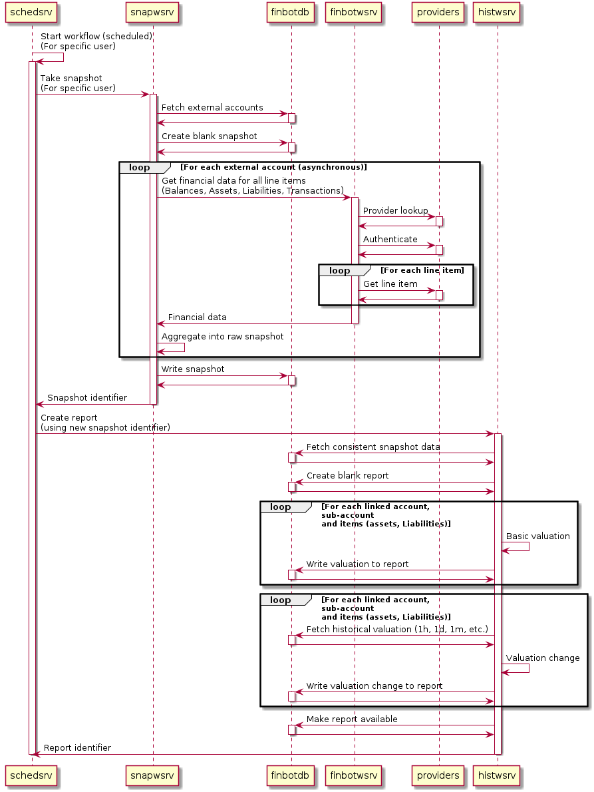

# finbot

## 1. Introduction

Open-source personal wealth & financial data aggregation and reporting platform.

### 1.1 Important disclaimer

This software is **intended to be self-hosted** (_i.e. will not and should not 
not be made available as a public service_) as it stores and uses personal 
credentials to access external financial platforms and services.
This software is built as a proof of concept, **use at your own risk!**

## 2. Developer guide

### 2.1. Development environment setup

A local development environment can be created by running the following command:

```bash
(host) $ make init-dev
```

This command can be re-executed at any point. **Word of caution**, the existing
database will be erased and initialized with the local development account.

### 2.2. Development environment management

#### 2.2.1. Applications development runtime

The entire `finbot` infrastructure can be run locally (as long as dependencies 
are available) but `Docker` and `docker-compose` is the preferred development
environment.

At this point, each application has its own docker container which provides its
respective runtime environment. The overall infrastructure orchestration is 
defined in `docker-compose.yml`. The development setup allows to make modifications
while running the finbot infrastructure, at which point applications are automatically restarted.

##### 2.2.2. Build all containers

```bash
$ docker-compose build
```

##### 2.2.3. Start containers

```bash
$ docker-compose up # All containers
$ docker-compose up -d # All containers in the background
$ docker-compose up dev # Just the 'dev' container
```

The finbot `webapp` becomes available at `127.0.0.1:5005` (by default) shortly
after all containers are started.

##### 2.2.4 Stop all containers

```bash
$ docker-compose down
```

##### 2.2.5. Remote in the dev container

A development container is started as part of the infrastructure and can be accessed with:

```bash
$ docker exec -it dev /bin/bash
```

##### 2.2.6. Edit local development account file

Local development account is stored as `.secure/account` (_by default_) and is 
automatically encrypted before being saved. This file is used mainly by the 
`providers-tester` utility but can also be used to provide initial data when
creating the development database. The file can be edited by running:

```bash
$ make edit-account
```

The `linked_accounts` section contains the list of all external accounts and 
credentials. The list of available providers and expected credentials can be
found in `finbot/providers/`.

You can export the `FINBOT_EDIT_CMD` to another editor if you do not want to 
use `vim`, for example:

```bash
$ export FINBOT_EDIT_CMD="code --wait"
```

##### 2.2.7. Create a new user account from the local development account file

```bash
$ make finbotdb-add-account
```

##### 2.2.7 Database management

The following command require `finbotdb` to be running:

```bash
$ make finbotdb-build # initialize finbotdb schema from the SQLAlchemy model
$ make finbotdb-rebuild # same as previously, but wipes the database first
$ make finbotdb-destroy # wipes the database
$ make finbotdb-add-account # creates a user account from the local account file
```

### 2.3. `finbot` architecture

#### 2.3.1. Backend components (`finbot/` subdirectory)

`finbot` backend implementation (Python):

- `apps/`: Backend applications (_web servers, scheduler_)
- `clients/`: Python clients given access to backend servers.
- `core/`: General-purpose packages (_high-level utilities, etc._)
- `model/`: `finbot` `SQLAlchemy` business model (_used to create finbotdb 
  database schema_)
- `providers/`: Implement the `finbot.providers.Base`. Each module gives access to
   a specific financial data provider:
   - Most implement `providers.SeleniumBased`, which use headless `Chrome` / 
   `selenium` to interact and scrape financial data off of external providers
   websites.
   - Others use proper APIs to access information (Google sheets API, Kraken for
   instance)

#### 2.3.2. Frontend components (`webapp/` subdirectory)

`finbot` web application implementation, based on node/React.

#### 2.3.3. Services topology

The finbot infrastructure is composed of 5 backend (web) services, one
database and a web application:

- **finbotwsrv / clients.finbot**: Web server responsible for fetching
financial data from external providers. It's a simpler wrapper around `finbot.providers`.
- **snapwsrv / clients.snap**: Web server responsible for the orchestration of
a single user account financial data snapshot (fetching and aggregating financial
data for all external accounts linked to a user account). This service interacts
directly with `finbotwsrv`.
- **histwsrv / clients.history**: Write financial reports for a given snapshot.
This includes:
  - **Fetching** 'consistent' financial data snapshot from the specified and 
    historical snapshots.
  - **Valuation of** user account, external accounts, sub-accounts (_accounts 
    under an external account_) and sub-accounts items (_assets, liabilities_).
  - **Valuation change (hourly, daily, monthly, etc.) of** user account, 
    external accounts, sub-accounts and sub-accounts items.
  - **[To be implemented]** Add (_resp. update_) new (_resp. existing_) 
    transactions in all external accounts.
- **schedsrv**: Currently in **very early** development stage. Will be 
  responsible for triggering and distributing the work required to snapshot and
  report financial data for individual user accounts. Currently only works for
  a single user account (hard-coded) and on a fixed schedule (once per hour by default)
- **appwsrv**: Public rest API exposing applicative features. Used directly by 
  the finbot web application. This includes, but is not limited to:
  - Users management (authentication, user creation, etc.)
  - External accounts registration
  - Access to financial reports:
    - Current valuation of assets and liabilities
    - Wealth distribution by external account, asset type
    - Historical accounts valuation

The following diagram shows existing components and their interactions.


#### 2.3.4. Financial data snapshot and reporting


